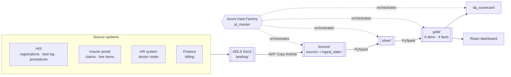

# MedChain Analytics — Hospital Claims & Patient Journey Lakehouse

A production-shaped medallion lakehouse (Bronze → Silver → Gold) on Azure Databricks
and Delta Lake, resolving patient identity, claim history, and insurance
reconciliation across a fictional 8-hospital network.

**Stack** — Azure Data Lake Storage Gen2 · Azure Data Factory · Azure Databricks ·
Delta Lake · PySpark 3.5 · Unity Catalog · React

---

## The problem

MedChain Analytics runs 8 hospitals across Delhi, Mumbai, Hyderabad, Pune and
Bangalore — 200,000 patient visits a year, claims through two insurers. Four systems
hold the data and none of them talk to each other: a hospital information system, an
insurer portal, an HR roster, and a finance application.

The consequences are specific:

| Symptom | Root cause |
|---|---|
| Finance takes 7–10 days to reconcile claims, and gets >12% wrong | TPA deduction logic exists only in people's heads |
| Doctors cannot see a patient's history at another hospital | The same person has a different `patient_id` at each site |
| Nobody can say why a claim was rejected three weeks ago | The portal stores only the *current* status |
| 2023 consultations are credited to a doctor's 2026 department | Roster exports carry no history |

Each maps to a named engineering pattern, and this repository implements all four.

## Results

Measured against ground truth, on 3 years of data (619,601 visits, 208,456 claims,
5.6M source rows):

| What was destroyed | What was recovered | Metric |
|---|---|---|
| Patient identity across 8 registration systems | 219,600 registrations → 183,469 people | **F1 0.953** (precision 0.999, recall 0.912) |
| Claim lifecycle history | 706,612 state transitions rebuilt from snapshots | **92.6% coverage, 100% fidelity** |
| TPA deduction breakdown | Exclusions, room cap, co-pay, deduction | **100% match on all 5 components** |
| ICD-10 codes (8% missing) | Tiered inference with provenance | **100% filled** — 5.2% exact, 1.5% fuzzy, 1.2% specialty |
| Bill ↔ claim linkage (no shared key) | Two independent matching routes | **99.9% linked**, 175 sent for review |

And what that buys the business:

- **Readmission is understated by 2.93 percentage points** when each hospital counts
  only its own returning patients (17.38%) instead of measuring across the network
  through resolved identities (20.31%).
- **60,990 consultations — 9.8% of all visits — would be credited to the wrong
  department** without effective-dated doctor history.
- **₹806 Cr of the ₹3,527 Cr billed is not reimbursed (22.8%)**, decomposed into
  ₹446 Cr co-pay (contractual), ₹162 Cr exclusions (contractual) and **₹74 Cr room-rent
  excess — the one bucket the hospital can actually recover** by matching admission
  room category to policy entitlement.

`50 data quality checks · 0 blocking failures · 57 tests passing`

---

## Architecture



**Bronze** — raw archive. Explicit schemas, every column read as a string, nothing
filtered or repaired. Partitioned by source and ingest date, every row carrying
`batch_id` / `source_file` / `ingestion_ts`.

**Silver** — the engineering. Master Patient Index, claim lifecycle reconstruction,
SCD Type 2, TPA rules engine, bed occupancy gap-fill, ICD-10 inference, bill↔claim
linkage.

**Gold** — star schema. 6 dimensions, 4 facts, point-in-time dimension joins.

All transformation logic lives in the `medchain` Python package. Databricks notebooks
are five-line wrappers that import it, so the code running on the cluster is the code
the test suite exercises.

---

## The four hard problems

### 1. Master Patient Index

The same person is `H001-P004821` at one hospital and `H005-P001190` at another, with
their name spelled differently, birth date in a different format, and possibly a
mistyped phone number.

- **Per-hospital date parsing.** H002 exports `03/04/1985` as 3 April; H004 exports the
  same string as 4 March. One global date format silently corrupts an eighth of all
  birth dates. Formats are declared per hospital in `conf/seed/source_date_formats.csv`.
- **Deterministic first** — SHA-256 over (normalised name, DOB, phone last 4).
- **Then blocked, probabilistic matching.** Comparing all pairs is 2.4×10¹⁰ comparisons.
  Four complementary blocking keys reduce that to 1.8M scored candidates, each key
  chosen so that whatever field a defect corrupts, another key still fires.
- **Three-way outcome.** ≥0.90 auto-links, 0.75–0.90 goes to a human review queue,
  below that stays distinct. Silently merging two people's medical histories is far
  worse than leaving a duplicate.
- **Stable IDs** from a persisted registry — an `mpi_id` means the same person next
  month as it does today.

### 2. Claim lifecycle reconstruction

The portal exports a snapshot of current status. Accumulating snapshots and
deduplicating on `(claim_id, status_code, status_date)` rebuilds the transitions.
Because the table is append-only and the MERGE only inserts, replaying any export is
a no-op.

Transitions are classified `DIRECT` / `GAP` / `ILLEGAL`. A weekly export legitimately
misses states that begin and end between snapshots — calling that "illegal" would
bury the genuine anomalies under thousands of sampling artefacts.

### 3. TPA deduction rules engine

Order of operations is the whole problem, and it mirrors how a TPA actually assesses:
exclusions first, then the room-rent cap on the *room line*, then co-pay on what
remains eligible, then the residual percentage. Applying co-pay to the gross, or the
room cap to the bill total, yields plausible numbers that are wrong by tens of
thousands of rupees — which is exactly how manual reconciliation drifts.

Reconciliation is reported honestly: 96% of rule-predictable claims are explained to
within ₹1. Rejected claims and discretionary partial approvals are reported
separately, because no rule can predict a medical officer's judgement call.

### 4. SCD Type 2 and point-in-time joins

Facts join dimensions on `fact_date BETWEEN effective_from AND effective_to`, never
on `is_current`. `fact_patient_visit` carries both attributions side by side so the
difference is measurable rather than asserted — it is 60,990 consultations.

---

## Quickstart

### Just look at the dashboard

If you have access to the Azure subscription this runs on, one command is enough.
Works on Windows, macOS and Linux:

```bash
python quickstart.py
```

```
> quickstart.cmd                      (Windows, or double-click it)
```

It signs you in if needed, finds the storage account, downloads the pre-computed
aggregates from ADLS, builds the frontend and serves it on
[localhost:4173](http://localhost:4173).

**Nothing is recomputed.** Bronze, Silver, Gold and the quality scorecard were built
on Databricks and the dashboard reads what that run produced — a full pipeline run
takes about an hour of cluster time and costs real money, so the default path does
not repeat it. The footer states which engine and store produced the numbers you are
looking at.

Needs Python 3.9+, Node 18+ and the Azure CLI. Nothing else — no Spark, no JDK, no
Databricks CLI.

<details>
<summary>Options</summary>

```
python quickstart.py --no-serve             set up, don't serve
python quickstart.py --port 8080            serve elsewhere
python quickstart.py --skip-data            rebuild the UI, keep the data
python quickstart.py --storage-account NAME skip account discovery
```
</details>

### Build the whole platform yourself

```bash
make setup                 # Python 3.11 venv + project-local Temurin JDK 17
make doctor                # verify Spark 3.5 + Delta 3.2 actually work
make gen SCALE=1.0         # 3 years of synthetic source data (~2 min, 600 MB)
make run-local             # bronze -> silver -> gold -> quality (~10 min)
make web-install           # frontend dependencies (once)
make web                   # export local Gold to JSON, build and serve the dashboard
```

`make test` runs the unit and Spark suites; `make test-integration` runs the full
end-to-end chain at 1% scale.

### Toolchain note

Spark 3.5 supports Python ≤ 3.11 and JDK 8/11/17. `make setup` pins Python 3.11 and
installs Temurin 17 to `~/.local/jdks/jdk-17`, leaving your system JDK untouched.
This matches **Databricks Runtime 15.4 LTS** exactly, so local behaviour and cluster
behaviour agree.

### Deploying to Azure

```bash
./infra/provision.sh --dry-run   # see the plan and the cost estimate first
./infra/provision.sh             # ~5 min; SPENDS CREDIT
make gen SCALE=1.0 && make upload
make deploy                      # wheel + notebooks + ADF pipelines
make run-azure                   # bronze -> silver -> gold -> quality -> web export
make web-azure                   # fetch what the cluster produced, build, serve
make cost                        # check spend
make stop                        # terminate clusters
./infra/teardown.sh              # delete everything
```

`make web` and `make web-azure` differ only in where the numbers come from, and the
dashboard footer names the source it actually loaded — so a page built from local
Gold cannot be mistaken for one built from the cluster's.

Cluster time is the entire budget — roughly 150–180 hours of all-purpose compute on a
$100 student grant. Everything except scaled runs and demos should happen locally,
where it costs nothing. See [docs/cost_log.md](docs/cost_log.md).

---

## Repository layout

```
conf/            environment config, source contracts, quality checks, seed reference data
src/medchain/    generate · bronze · silver · gold · quality · utils
notebooks/       thin Databricks wrappers around the package
adf/             Data Factory pipeline definitions
infra/           provision · budget · upload · deploy · cost · stop · teardown
dashboards/web/  React dashboard (Vite + TypeScript, static build)
tests/           unit (32) · spark (14) · integration (11)
docs/            architecture · lineage · runbook · data dictionary · ADRs
```

## Documentation

| Document | What it covers |
|---|---|
| [architecture.md](docs/architecture.md) | Layer design and the reasoning behind it |
| [lineage.md](docs/lineage.md) | Table and column-level lineage |
| [runbook.md](docs/runbook.md) | Daily operation, backfill, failure playbook |
| [data_dictionary.md](docs/data_dictionary.md) | Every Gold column |
| [business_questions.md](docs/business_questions.md) | The 7 questions, with SQL and answers |
| [scorecard.md](docs/scorecard.md) | Quality framework and current results |
| [dashboard](dashboards/web/) | React dashboard — charts, palette, layout |
| [cost_log.md](docs/cost_log.md) | Azure spend tracking |
| [adr/](docs/adr/) | Five decision records |

## Data

All source data is synthetic, generated by `medchain-gen` from a fixed seed — no real
patient data is involved. The generator builds a clean world, then deliberately
damages it in the seven ways the problem statement describes, and writes the
undamaged version to `data/_truth/`. That truth is never read by the pipeline; it
exists so the scorecard can report *measured* precision and recall rather than
internal consistency checks that would pass even if the matching logic were wrong.
