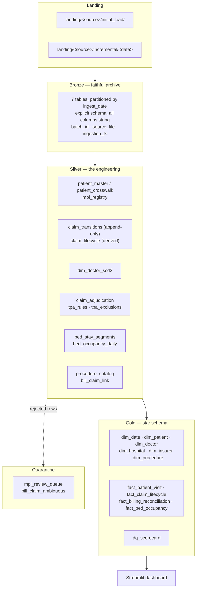

# Architecture

## Medallion layers



## Layer contracts

### Bronze — archive

Three rules, each protecting against a specific failure:

1. **Explicit schemas, every column read as a string.** Inference is
   non-deterministic across batches; casting destroys the original value of a
   malformed field. See [ADR-003](adr/003-explicit-schemas-and-header-validation.md).
2. **No filtering, deduplication or repair.** If Silver logic turns out to be wrong,
   Bronze must still hold everything needed to rebuild. A Bronze layer that has
   already cleaned the data cannot do that.
3. **Every row traceable, every batch replayable.** `batch_id`, `source_file`,
   `ingestion_ts` on every row; `control.batch_registry` makes re-running a completed
   date a no-op.

Partitioned by `ingest_date`, extracted from the file name, so reprocessing one day is
partition-scoped rather than a full rewrite.

### Silver — resolution

| Module | Output | Problem solved |
|---|---|---|
| `mpi.py` | `patient_master`, `patient_crosswalk`, `mpi_registry` | Identity fragmentation |
| `claim_history.py` | `claim_transitions`, `claim_lifecycle` | Lost lifecycle history |
| `scd2.py` + `doctors.py` | `dim_doctor_scd2` | Department reassignment |
| `tpa_rules.py` | `claim_adjudication` | Uncodified deductions |
| `bed_gapfill.py` | `bed_stay_segments`, `bed_occupancy_daily` | Events, not daily state |
| `procedures.py` | `procedure_catalog` | Missing ICD-10 codes |
| `bill_claim_link.py` | `bill_claim_link` | No shared key across systems |

Dependency order is real: `procedures` and `mpi` before the rest, `claim_history`
before `tpa_rules` and `bill_claim_link`.

### Gold — star schema

Six dimensions, four facts. Two design choices carry most of the analytical value:

**Point-in-time dimension joins.** Facts join SCD2 dimensions on
`fact_date BETWEEN effective_from AND effective_to`, never on `is_current`. A March
2023 consultation resolves to the department that doctor worked in during March 2023.
`fact_patient_visit` carries both `department_at_visit` and `department_current` so the
difference is measurable: **60,990 consultations, 9.8% of all visits**.

**Network-wide readmission.** `readmit_30d_network` (any hospital, via `mpi_id`)
alongside `readmit_30d_same_hospital`. The gap — **2.93 percentage points** — is the
readmission cohort no single hospital can see.

## Portability

All transformation logic lives in the `medchain` package. Notebooks are five-line
wrappers. Paths resolve through `conf/*.yaml` keyed on `MEDCHAIN_ENV`:

```python
cfg.table_path("silver", "mpi_registry")
# local → /home/.../data/silver/mpi_registry
# azure → abfss://silver@stmedchain....dfs.core.windows.net/mpi_registry
```

Tables are addressed by **path** on every environment. Unity Catalog registration
creates *external* tables over those same paths, so the catalog is a view onto the
storage layout rather than a competing source of truth. There is no environment
branching inside transformation code.

This is what makes the test suite meaningful: `pytest tests/spark` exercises the exact
functions the cluster runs.

## Version pinning

| Component | Version | Why |
|---|---|---|
| Databricks Runtime | 15.4 LTS | Long-term support; Spark 3.5.0, Python 3.11, JDK 17 |
| PySpark | 3.5.0 | Matches DBR exactly |
| delta-spark | 3.2.0 | Pairs with Spark 3.5.x |
| Python | 3.11 | Matches DBR; PySpark 3.5 does not support 3.12+ |
| JDK | Temurin 17 | Spark 3.5 supports 8/11/17 only |

Local and cluster behaviour agree because the versions agree. Mixing Delta and Spark
versions produces protocol errors that surface on write, not on startup.

## Orchestration

`pl_master` (ADF) → ForEach over sources → `pl_ingest_source` (Copy Activity) →
Databricks notebook activities for Silver → Gold → Quality, with `dependsOn` edges so
a Silver failure never lets a stale Gold build publish.

- Daily 02:00 IST for HIS, finance and bed sources
- Weekly Sunday for the insurer portal and HR roster
- `control.watermark` advances only after a successful downstream write

## Physical design

- Facts partitioned by date (`admission_date`, `status_date`, `occupancy_date`)
- `OPTIMIZE ... ZORDER BY` on high-cardinality join keys after each Gold build
- `VACUUM RETAIN 168 HOURS` — 7 days of time travel for recovery
- Bronze partitioned by `ingest_date` for scoped reprocessing
